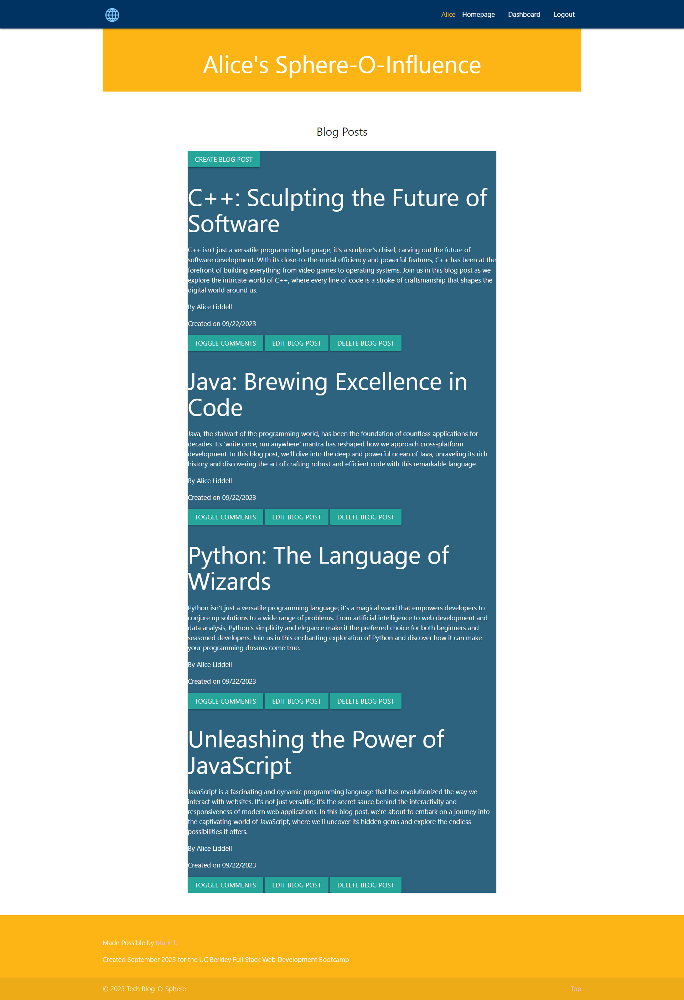

# MVC-Tech-Blog
Model-View-Controller (MVC) Challenge: Tech Blog

## Description
Tech Blog-O-Sphere is an innovative and fun opportunity for you to interact with other professionals and enthusiasts in the field of technology. Read and comment on user's posts, create your own posts, and build your sphere of influence in the every growing world of tech.

## Table of Contents (if applicable)

- [Description](#description)
- [Features](#features)
- [Installation](#installation)
- [Usage](#usage)
- [License](#license)
- [Contact Info](#contact-info)

## Features

- Create a safely encrypted User Profile that allows you to log in and log out to the site while protecting access to your own posts
- View and comment on any blog post from the homepage
- Create, view, update, comment on, and/or delete any of your posts from the dashboard page
- Using dayJs, socket.io, nodejs, expressjs, jawsdb, and materialize the site is dynamic, responsive, and mobile friendly, updating in real time so you don't have to miss the pulse of the tech world or your sphere of influence on it.

## Installation

N/A

## Usage
Access the site with this [link](https://tech-blog-o-sphere-596c6346b94a.herokuapp.com/). Click the "See how far the rabbit hole goes!" button and setup your account.  You now have access to any and all blogpost that our user put up.  Feel free to browse previous posts and add comments.  Click over to the dashboard to see your own posts.  Here you can create, update, comment on, and delete your posts.  The site is mobile ready as well.

## License
This project is covered under the MIT [License](https://choosealicense.com/licenses/${license}).

## Contact Info

- Github: [https://github.com/markthos](https://github.com/https://github.com/markthos)
- Email: aydenthos@gmail.com